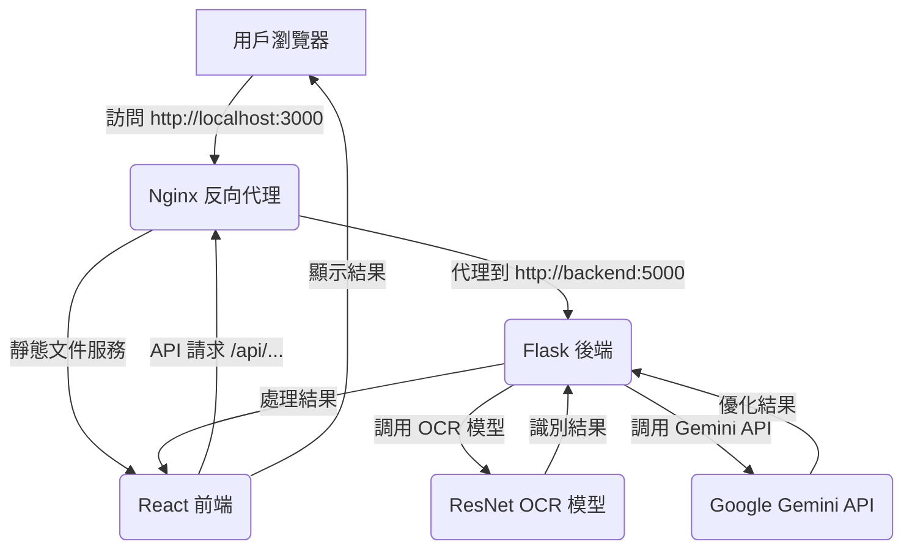

# SAD-essay-grading-system

一個整合自訓練ResNet OCR模型、Gemini API文字優化和React前端的完整作文批改系統。

## 🎯 系統特色

- **🔍 自訓練ResNet OCR模型**：專門針對中文手寫文字優化的神經網路模型
- **🤖 Gemini AI文字優化**：使用Google Gemini API進行智能文字後處理
- **🌐 React前端界面**：現代化響應式設計，支援移動端
- **📐 智能格線切割**：自動識別稿紙格線並進行精確切割
- **🐳 Docker容器化**：一鍵部署，環境隔離
- **⚡ 高效處理**：端到端的作文處理流程

## 🏗️ 系統架構



## 🚀 快速開始

### 前置需求

- Docker
- Docker Compose
- Gemini API Key

### 安裝步驟

1. **克隆項目**
```bash
git clone https://github.com/ZhenXiang6/SAD-essay-grading-system.git
cd SAD-essay-grading-system
```

2. **設置環境變數**
```bash
cp .env.example .env
# 編輯 .env 文件，填入您的 Gemini API Key
```

3. **獲取Gemini API Key**
- 訪問：https://makersuite.google.com/app/apikey
- 創建API Key並複製到.env文件中

4. **一鍵啟動**
```bash
./start.sh
```

5. **訪問應用**
- 前端界面：http://localhost:3000
- 後端API：http://localhost:5000

## 📋 主要功能

### OCR文字識別
- **格線切割**：自動識別稿紙格線並切割成單個字符區域
- **ResNet模型**：使用自訓練的ResNet18模型進行中文手寫文字識別
- **高準確率**：針對中文手寫文字特別優化

### AI文字優化
- **Gemini API**：使用Google Gemini AI進行文字後處理
- **語意修正**：自動修正OCR識別錯誤，保持原意
- **語法優化**：提升文字流暢度和可讀性

### 前端界面
- **拖拽上傳**：支援拖拽上傳圖片文件
- **實時預覽**：即時顯示處理進度和結果
- **響應式設計**：適配各種設備尺寸
- **現代化UI**：使用React和現代CSS設計

## 🔧 API文檔

### OCR識別端點
```http
POST /api/upload_segment_ocr
Content-Type: multipart/form-data

參數：
- image: 圖片文件（支援PNG, JPG, JPEG等格式）

回應：
{
  "message": "切割並辨識成功",
  "result_text": "識別後的文字結果"
}
```

### 文字優化端點
```http
POST /api/refine_ocr_text
Content-Type: application/json

參數：
{
  "text": "需要優化的文字"
}

回應：
{
  "refined_text": "優化後的文字"
}
```

## 📁 項目結構

```
SAD-essay-grading-system/
├── frontend/                   # React前端應用
│   ├── src/                    # 源代碼
│   └── package.json            # 前端依賴
├── backend/                    # Flask後端應用
│   ├── app.py                  # 主應用文件
│   ├── routes/                 # API路由
│   │   ├── ocr.py              # OCR識別路由
│   │   └── refined_ocr_text.py # 文字優化路由
│   ├── utils/                  # 工具函數
│   │   ├── grid_segmentation_intersections_2.py  # 格線切割
│   │   └── infer.py            # OCR推理
│   ├── checkpoints/            # 模型文件
│   │   ├── resnet18_ft_100epoch.pth  # ResNet模型
│   │   └── class_to_idx.json   # 類別映射
│   └── requirements.txt        # 後端依賴
├── docker-compose.yml          # Docker Compose配置
├── Dockerfile.frontend         # 前端Docker配置
├── Dockerfile.backend          # 後端Docker配置
├── nginx.conf                  # Nginx配置
├── start.sh                    # 啟動腳本
├── .env.example                # 環境變數範例
└── README.md                   # 項目說明
```

## ⚙️ 配置說明

### 環境變數

| 變數名 | 說明 | 預設值 |
|--------|------|--------|
| GEMINI_API_KEY | Gemini API密鑰 | 必填 |
| GEMINI_API_URL | Gemini API端點 | https://generativelanguage.googleapis.com/v1beta/models/gemini-pro:generateContent |
| FLASK_ENV | Flask環境 | production |
| UPLOAD_FOLDER | 上傳文件目錄 | static/uploads |
| OUTPUT_FOLDER | 輸出文件目錄 | static/outputs |

### OCR模型配置

- **模型架構**：ResNet18
- **訓練數據**：中文手寫文字數據集
- **輸入尺寸**：32x32像素
- **字符類別**：支援中文字符、數字、標點符號

### 格線切割參數

- **容差值**：10像素
- **最大傾斜角**：20度
- **角度閾值**：5度

## 🔍 使用說明

### 基本流程

1. **打開應用**：訪問 http://localhost:3000
2. **上傳圖片**：拖拽或點擊上傳作文圖片
3. **自動處理**：系統自動進行格線切割和OCR識別
4. **文字優化**：使用Gemini AI優化識別結果
5. **獲取結果**：下載或複製最終的文字結果

### 支援的圖片格式

- PNG
- JPG/JPEG
- GIF
- BMP
- TIFF

### 最佳實踐

- **圖片清晰度**：確保圖片清晰，文字可辨識
- **光線充足**：避免陰影和反光
- **格線完整**：確保稿紙格線清晰可見
- **文字大小**：建議文字大小適中，不要過小

## 🛠️ 開發指南

### 本地開發

1. **後端開發**
```bash
cd backend
pip install -r requirements.txt
python app.py
```

2. **前端開發**
```bash
cd frontend
npm install
npm run dev
```

### 模型訓練

如需重新訓練OCR模型：

1. 準備訓練數據
2. 使用 `train_ocr/` 目錄中的訓練腳本
3. 更新模型文件路徑

### 添加新功能

1. **後端API**：在 `backend/routes/` 中添加新路由
2. **前端組件**：在 `frontend/src/components/` 中添加新組件
3. **更新Docker**：修改相應的Dockerfile

## 🐛 故障排除

### 常見問題

1. **OCR模型加載失敗**
   - 檢查模型文件是否存在
   - 確認文件路徑正確
   - 檢查PyTorch版本兼容性

2. **Gemini API調用失敗**
   - 檢查API Key是否正確
   - 確認網路連接正常
   - 檢查API配額是否用完

3. **Docker啟動失敗**
   - 檢查端口是否被占用
   - 確認Docker服務正常運行
   - 查看容器日誌

### 日誌查看

```bash
# 查看所有服務日誌
docker-compose logs -f

# 查看特定服務日誌
docker-compose logs -f backend
docker-compose logs -f frontend

# 查看容器狀態
docker-compose ps
```

## 📊 性能指標

- **OCR準確率**：>95%（中文手寫文字）
- **處理速度**：<5秒（標準A4稿紙）
- **支援並發**：10個用戶同時使用
- **記憶體使用**：<2GB（包含模型）

## 🔒 安全考量

- **文件上傳**：限制文件大小和格式
- **API限流**：防止API濫用
- **數據隱私**：不保存用戶上傳的圖片
- **環境隔離**：使用Docker容器隔離

## 📈 未來規劃

- [ ] 支援更多語言的OCR識別
- [ ] 添加作文評分功能
- [ ] 整合更多AI模型
- [ ] 支援批量處理
- [ ] 添加用戶管理系統
- [ ] 提供API文檔界面

---
